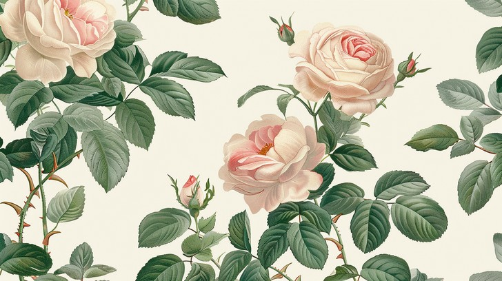
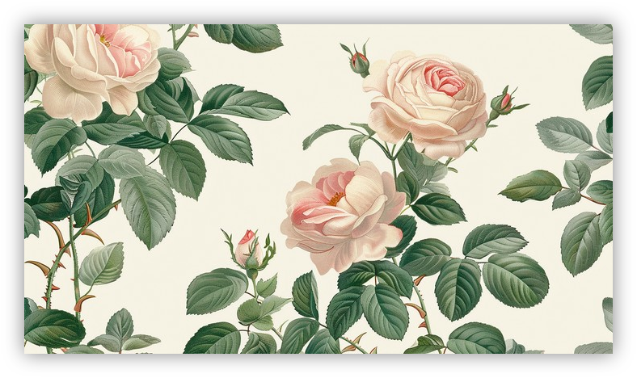

<h1 align="center">shadowizer</h1>

<p align="center">A cli tool for adding box shadow to images</p>

<p align="center">


</p>

<pre align="center">npm i -g <b>shadowizer</b></pre>

<p align='center'><b>Before</b></p>

<p align='center'>

</p>

<p align='center'><b>After</b></p>

<p align='center'>

</p>

## Usage

See `shadowizer --help` for more details.

### shadowizer [root]

Find images and add box shadow to them. You can specify the root directory, which can be an absolute path, or a path relative to the current working directory. Default to `process.cwd()`.

It should be noted that all images with added shadows will be output in `png` format to the `shadowizer-{timestamp}` directory in the root directory.

> Why not other output formats such as `jpeg`, because png supports transparency.

| Options                | Description                                                                  |
| ---------------------- | :--------------------------------------------------------------------------- |
| `-f, --files`          | specify png images, support glob patterns, default: `\*.{png,jpg,jpeg,webp}` |
| `-c, --shadowColor`    | set shadow color, default: `#00000073`                                       |
| `-b, --shadowBlur`     | set shadow blur, default: `25`                                               |
| `-x, --shadowOffsetX`  | set shadow offset x, default: `0`                                            |
| `-y, --shadowOffsetY ` | set shadow offset y, default: `0`                                            |

Example：

```sh
# specify directory to find png images
shadowizer path/to

# specify multiple images
shadowizer -f text.png -f fun.png

# specify images with glob patterns
shadowizer -f *.png

# set shadow color
shadowizer -c #00000073
```

## API

### addShadow

- type: `(imagePath: string, shadow?: ShadowOptions) => Promise<void | Buffer>`

Adds a box shadow to the specified image.

```js
import { addShadow } from 'shadowizer'
```

### saveShadowImage

- type: `(imagePath: string, outDir?: string, shadow?: ShadowOptions) => Promise<boolean>`

Adds a box shadow to the specified image and saves it to disk.

```js
import { saveShadowImage } from 'shadowizer'
```

## License

[MIT](./LICENSE) © alex.wei
